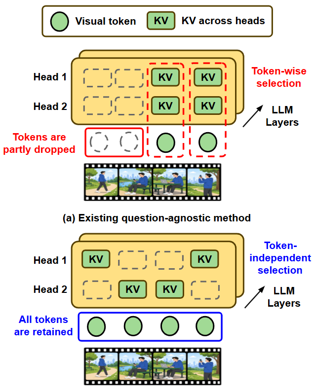

# Dive: Accurate and Efficient Video Large Language Models for Lifespan Question via Head-wise Visual KV Cache Compression

This repository is the official implementation of **Dive: Accurate and Efficient Video Large Language Models for Lifespan Question via Head-wise Visual KV Cache Compression**.

<p align="center">
  
</p>


## Abstract📌
Given a Video Large Language Model (VLLM) and a pre-recorded video, how can we minimize the cumulative inference latency over future questions?
Addressing this is crucial since VLLMs not only serve a massive volume of questions over the video's lifespan but also incur substantial latency for each question.
Existing methods compress visual tokens generated from a video to accelerate inference for each question.
However, under aggressive compression ratios, prior approaches suffer from severe accuracy degradation, still resulting in high inference latency on each question.
In this paper, we propose Dive, a visual KV cache compression method that preserves accuracy even under aggressive compression ratios.
Dive significantly reduces per-question prefill and decoding latency, thereby achieving low cumulative latency over a massive volume of questions.
To achieve this, Dive evicts KV pairs for each head independently.
Experiments show that Dive retains 98.2\% of accuracy, using only 5\% of the KV cache in Qwen2.5-VL.

## Requirements 📋

Ensure you have Python installed (recommended Python 3.10+).  
The required packages are:

```txt
torch==2.5.1+cu121
transformers==4.57.3
accelerate==1.12.0
Pillow==12.0.0
flash-attn==2.7.4.post1
```

You can install all required dependencies using:

```bash
pip install -r requirements.txt
```

## Dataset 📁

| Benchmark | Description |
|-----------|-------------|
| VideoMME | Comprehensive video understanding benchmark with 900 videos, 6 domains, and 2,700 human-annotated multiple-choice QA pairs. |
| LongVideoBench | Long-context video-language benchmark with 3,763 videos and 6,678 referring-reasoning multiple-choice questions. |
| MVBench | Temporal video understanding benchmark with 20 systematically constructed tasks requiring complex temporal reasoning. |
| EgoSchema | Egocentric long-video benchmark with about 5,000 five-choice questions over 289 three-minute clips. |
| MLVU | Long-video understanding benchmark with 3,102 multiple-choice questions across nine diverse tasks. |

## Usage 💻

To run the demo on GPU:

Helper modules and the 16 demo frames are stored under `src/`.


`gather` execution:

```bash
CUDA_VISIBLE_DEVICES=1 python demo_llavaOV.py --prune-exec gather --print-response
```

`mask` execution:

```bash
CUDA_VISIBLE_DEVICES=1 python demo_llavaOV.py --prune-exec mask --print-response
```


